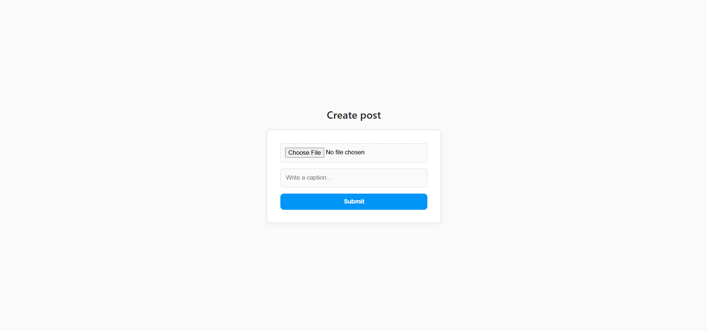

# 📸 Post Creation & Display Web App

A simple web application that allows users to create posts by uploading images with captions and view them in a structured feed layout.

---

## 🚀 Features

- 📤 Upload images from local device  
- 📝 Add captions to posts  
- 🖼️ Display posts in a clean feed  
- ❤️ Like, 💬 Comment, ✈️ Share (UI-based icons)  
- 🎯 Simple and user-friendly interface  

---

## 🧱 Project Structure

The application consists of two main pages:

### 1. Create Post Page
- Upload an image  
- Enter a caption  
- Submit the post  

### 📸 Screenshot


---

### 2. Posts Display Page
- View all uploaded posts  
- Each post includes:
  - Image  
  - Caption  
  - Interaction icons (like, comment, share)  

### 📸 Screenshot


---

## 🛠️ Tech Stack

- **Frontend:** HTML, CSS, JavaScript  
- **Backend:** Node.js / Express (if used)  
- **Database:** (Add if used, e.g., MongoDB)

---

## 📂 Installation & Setup

1. Clone the repository:
```bash
git clone https://github.com/sanjanamaharana/1-backend-project.git
```
2. Navigate to the project folder:
 cd 1-backend-project

3. Install dependencies (if any):
npm install

4. Run the project:
npm start
